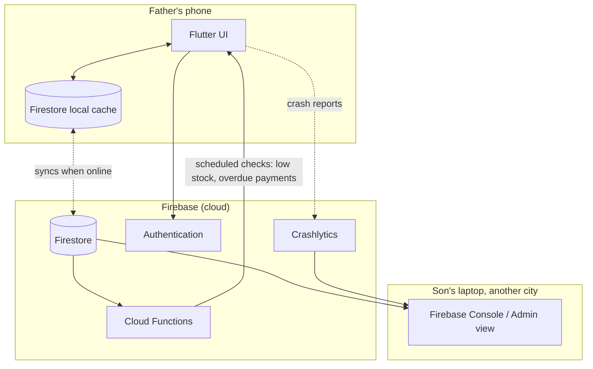

# Smart Business Manager — Architecture

## 1. Stack summary

| Layer | Choice | Notes |
|---|---|---|
| App framework | Flutter | One codebase, Android-first, room to expand to iOS/web later |
| Build tool | Google Antigravity | Agentic IDE with native Flutter + Firebase integration |
| Backend / database | Firebase | Firestore (data), Authentication (login), Cloud Functions (scheduled/server-side logic), Crashlytics (remote error visibility), App Distribution (remote updates) |
| State management | Riverpod (recommended) | Testable, works cleanly with Firestore streams for reactive UI updates |
| Local persistence | Firestore's built-in offline cache | No separate local database — see rationale below |

## 2. High-level architecture

The important property of this diagram: the phone never talks to a custom server. The Flutter app talks directly to Firebase SDKs, and those SDKs handle the online/offline distinction transparently. The son's visibility into the business comes from reading the same Firestore data and the same Crashlytics stream, from wherever he is.

## 3. Component responsibilities

- **UI layer (Flutter widgets)**: screens for each module (Dashboard, Inventory, Sales, etc.). Large fonts, large tap targets, per the PRD's non-functional requirements.
- **State layer (Riverpod providers)**: wraps Firestore streams so widgets rebuild automatically when data changes — including when queued offline writes finally sync.
- **Data layer (repository classes)**: one repository per collection (`CustomerRepository`, `ProductRepository`, `SaleRepository`, etc.), each responsible for reads, writes, and the atomic-increment calls described in `system-design.md`. This is the layer that should be built and tested first (see `AGENTS.md`).
- **Firebase SDKs**: `cloud_firestore`, `firebase_auth`, `firebase_crashlytics`. No custom backend server exists or is needed.
- **Cloud Functions**: the only server-side code in the system, used solely for logic that must run even when the phone is closed — scheduled low-stock and overdue-payment checks (see `system-design.md` §6).

## 4. Why these choices

- **Firebase over a local database (Drift/SQLite) with custom sync**: a hand-built sync layer is exactly the kind of thing that breaks in ways only visible on the operator's phone, and the son isn't there to debug it in person. Firestore's offline persistence is maintained by Google, not by us, and gives the son a live remote window into the business's data for free.
- **Firebase over Isar/Hive**: both have unresolved maintenance concerns (original authors stepped back; community forks carry the risk), and neither models relational-style data (customers → sales → payments) as cleanly as Firestore's transaction/increment primitives do.
- **Antigravity as the build tool**: chosen by the developer; has native Flutter and Firebase support, which reduces integration friction for an AI-agent-driven build process.
- **Riverpod over other state management**: pairs cleanly with Firestore's stream-based API, keeping the UI reactive without manual polling or refresh logic.

## 5. Environments

Two separate Firebase projects:
- **`smart-business-manager-dev`** — used during development in Antigravity. Safe to break, reset, or fill with test data.
- **`smart-business-manager-prod`** — the father's real business data. Never touched directly during development; only receives builds that have been verified against the dev project.

## 6. Key dependencies

- `cloud_firestore`, `firebase_core`, `firebase_auth`, `firebase_crashlytics`
- `flutter_riverpod`
- `intl` (for currency/date formatting now, full localization later)
- `pdf` or similar (for invoice generation, Module 10)

## 7. Deployment and update flow

1. Build and test against the dev Firebase project inside Antigravity.
2. Distribute test builds to the father's phone via **Firebase App Distribution** (a link he taps to install — no cable, no visit required).
3. Once stable, move to a **Google Play internal testing track** so updates arrive the way any Play Store app updates, without any manual step from either side.
